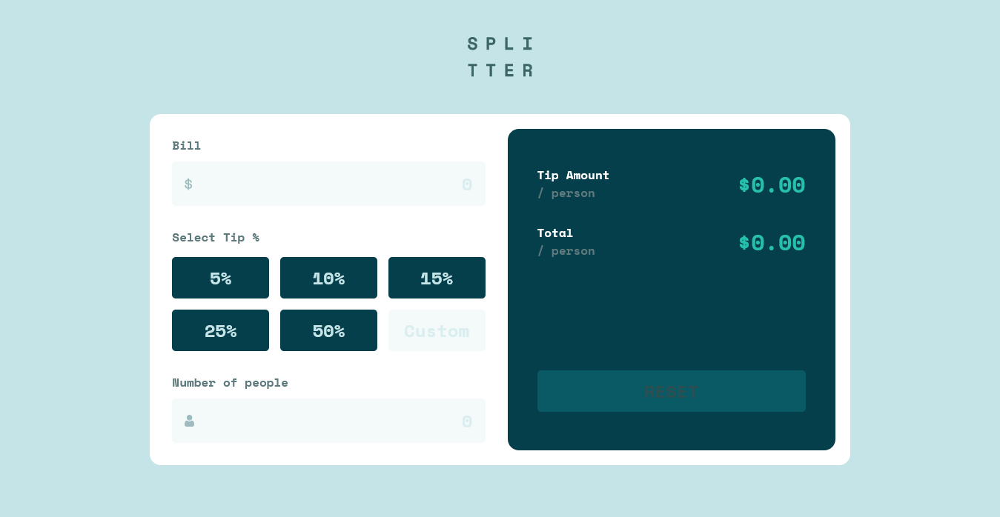
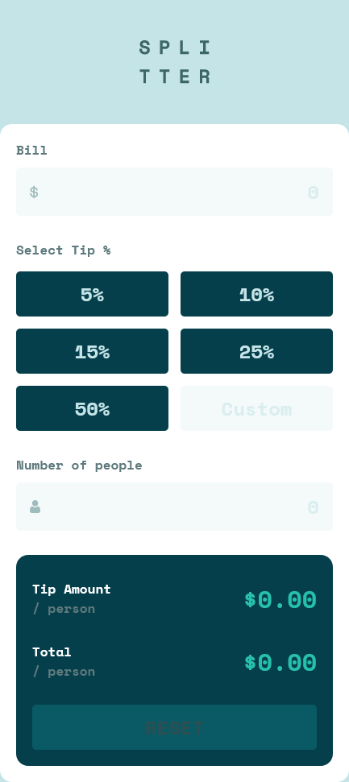

# Frontend Mentor - Tip calculator app solution

This is a solution to the [Tip calculator app challenge on Frontend Mentor](https://www.frontendmentor.io/challenges/tip-calculator-app-ugJNGbJUX).

### The challenge

Users will be able to:

- View the optimal layout for the app depending on their device's screen size
- See hover states for all interactive elements on the page
- Calculate the correct tip and total cost of the bill per person

### Screenshot

Desktop preview

Mobile preview

### Links

- Solution URL: [https://github.com/olanrewajuyusuf/Tip_calculator_app]
- Live Site URL: [https://wallewdev-tip-calculator.netlify.app]

## My process

A mobile first approach project

### Built with

- Semantic HTML5 markup
- CSS custom properties
- Flexbox
- CSS Grid
- Mobile-first workflow

## Author

- Website - [Olanrewaju Yusuf](https://wallewdev-portfolio.netlify.app)
- Frontend Mentor - [@olanrewajuyusuf](https://www.frontendmentor.io/profile/olanrewajuyusuf)
- Twitter - [@WaliyyullahY](https://www.twitter.com/WaliyyullahY)
